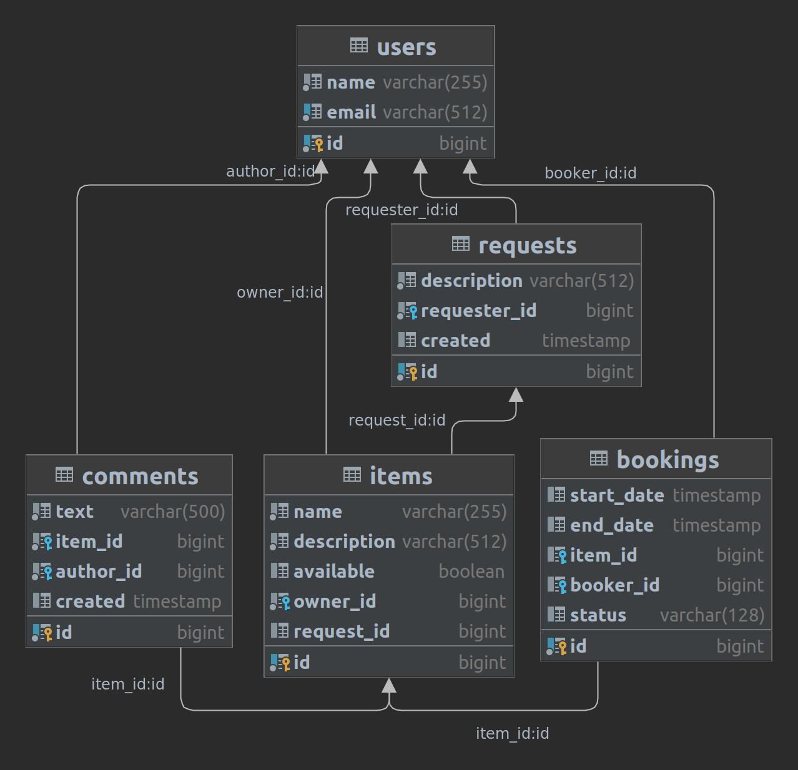

## Shareit
Сервис для размещения и поиска вещей, для дальнейшей аренды.

### Технологии: 
Java 11 на базе Spring Boot. В разработке использованы REST API, PostgreSQL, Hibernate ORM, Lombok, Docker

### Описание:
Владелец добавляет вещь, указывает имя и описание. Пользователи могут найти вещь по поиску и забронировать её на нужный 
промежуток времени. Если такой вещи не найдено - возможно оставить запрос, чтобы владельцы могли добавить нужную вещь.
Если вещь найдена, оставляется запрос на бронирование. Владелец должен его подтвердить. 
Также после пользования вещью арендатор имеет возможность оставить отзыв.

### Diagram:

